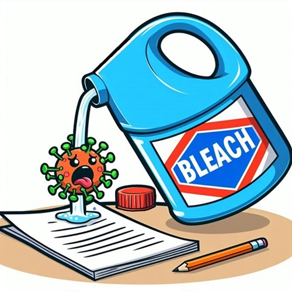

# MS Office Macro Bleach

A command-line tool designed to detect and purge any and all macros and dynamic content from commonly used office document formats (including MS Office Files, PDFs, etc.).

## Supported formats

### Word
- .docx: Word Document
- .doc: Word Document (1997 - 2007)
- .docm: Word Document with Macros
- .dotx: Word Template
- .dotm: Word Template with Macros

### PowerPoint
- .pptx: PowerPoint Presentation
- .pptm: PowerPoint Presentation with Macros
- .potx: PowerPoint Template
- .potm: PowerPoint Template with Macros
- .ppsx: PowerPoint Show
- .ppsm: PowerPoint Show with Macros

### Excel
- .xlsx: Excel Spreadsheet
- .xls: Excel Spreadsheet (1997 - 2007)
- .xlsm: Excel Spreadsheet with Macros
- .xltx: Excel Template
- .xltm: Excel Template with Macros

## Planned formats
- .ppt: PowerPoint Presentation (1997 - 2007)
- .pdf: Portable Document File


## Problem

VBA and OLE content in MS Office files can, and have sometimes been made to, act as vehicles for malware delivery.

Microsoft has previously attempted to protect users from macros by disabling them by default.  However, anybody is able to enable macros in an MS Office file before sending them on to a potential victim.

This Python tool aims to detect and remove any of this potentially malicious content from given files.


## Solution

A command-line program written in modern Python (3.10+) that is capable of locating and removing macros and dynamic content from a variety of files.

It should support all the common Office Open XML formats, 'legacy', MS binary files, and PDFs.


## Usage

This package has not yet been published. It can be used, however, by cloning the repo, opening the command prompt in it, and running the following command:

```poetry run bleach <PATH_TO_FILE>```

The optional '-c' flag may be appended to the command to enable notification if any macros are detected.
